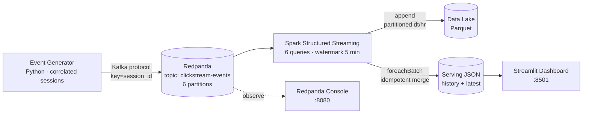

# ⚡ Realtime Clickstream Analytics Platform


An end-to-end **streaming analytics platform** for e-commerce clickstream data.
A synthetic event generator produces realistic user sessions into Redpanda;
a Spark Structured Streaming application computes windowed revenue, product,
funnel, and session metrics on **event time**; results land in a Parquet data
lake and a live Streamlit dashboard.

## The problem

Batch pipelines answer "what happened yesterday." Product and growth teams
need "what is happening *right now*": revenue per minute during a flash sale,
funnel conversion as a deploy rolls out, traffic spikes as they happen. This
project is a complete, runnable reference for that stack.

## Architecture



### Components

| Component | What it does |
|---|---|
| `generator/` | Produces realistic, **correlated user sessions** (view → cart → purchase funnels via a Markov chain over 28 products), not independent random events. Event times carry skew plus ~3% intentionally late arrivals (6–10 min) to exercise watermarking. Keyed by `session_id` for per-session ordering. |
| `streaming/` | Six Structured Streaming queries: raw Parquet lake sink, revenue/min, top products/5-min, session funnel/5-min, throughput + active sessions/min, and per-batch end-to-end latency. Windowed queries run in **append mode with a 5-minute watermark** — each window fires exactly once. |
| `dashboard/` | Live Streamlit dashboard: throughput, revenue/min chart, top products, funnel conversion with stage rates, latency trend. Auto-refreshes every 5s from the serving JSON. |
| `tests/` | Unit tests for every transformation on static DataFrames with fixed event times — no cluster needed. |

## Engineering decisions

- **Event time, not processing time.** Every aggregation is computed on `event_time`
  set by the producer. Processing-time aggregations silently misattribute late
  data; event-time windows stay correct when traffic spikes or consumers lag.
- **Watermark of 5 minutes.** Bounds the state Spark must retain while tolerating
  realistic out-of-orderness. Events later than the watermark are dropped as
  late data — the generator deliberately emits some, so you can watch this happen.
- **Why Redpanda.** Kafka-protocol compatible, single binary, no ZooKeeper/KRaft
  to operate. Point `KAFKA_BOOTSTRAP` at MSK/Confluent and nothing else changes.
- **Exactly-once story.** Kafka offsets are committed through Spark checkpointing;
  the Parquet lake sink is append + idempotent per micro-batch; the serving-JSON
  writer merges keyed by `window_start`, so a reprocessed batch overwrites rather
  than duplicates points.
- **Session funnel, not event funnel.** The funnel collapses to one row per
  session per window first (did the session *reach* each stage?), so a user who
  views twice doesn't inflate the denominator.
- **Transformations are pure functions** (`streaming/transformations.py`), shared
  by the streaming job and the unit tests — the code that runs in production is
  the code under test.

## Run it

One command:

```bash
docker compose up --build
```

| URL | What |
|---|---|
| http://localhost:8501 | Live dashboard |
| http://localhost:8080 | Redpanda console (topics, throughput, consumer lag) |

Give it ~2 minutes: the generator warms up, Spark starts its queries, and the
dashboard lights up. Tune the load with `EVENT_RATE` in `docker-compose.yml`.

Sample serving output (`data/serving/revenue_history.jsonl`):

```json
{"window_start": "2026-01-01 12:00:00", "window_end": "2026-01-01 12:01:00", "revenue": 1849.73, "purchases": 21}
{"window_start": "2026-01-01 12:01:00", "window_end": "2026-01-01 12:02:00", "revenue": 2104.15, "purchases": 24}
```

## Run the tests

```bash
pip install -r streaming/requirements.txt pytest   # needs Java 17+
pytest tests/ -v
```

## Repo layout

```
├── generator/            # synthetic clickstream producer -> Redpanda
│   ├── event_generator.py
│   ├── requirements.txt
│   └── Dockerfile
├── streaming/            # Spark Structured Streaming app
│   ├── job.py            # six streaming queries + serving sink
│   ├── transformations.py# pure, tested windowed aggregations
│   ├── requirements.txt
│   └── Dockerfile        # spark 3.5 + kafka connector jars baked in
├── dashboard/            # Streamlit live dashboard
│   ├── app.py
│   ├── requirements.txt
│   └── Dockerfile
├── tests/                # pytest: transformation logic on static DataFrames
├── .github/workflows/ci.yml
├── docker-compose.yml    # redpanda + console + generator + spark + dashboard
└── data/                 # gitignored: lake, checkpoints, serving JSON
```

## Tech stack

Python 3.11 · Apache Spark 3.5 (Structured Streaming) · Redpanda (Kafka API) ·
Streamlit · Parquet · Docker Compose · pytest · GitHub Actions

## Future improvements

- Exactly-once serving sink via transactional writes (Delta Lake `MERGE`)
- Sessionization with `flatMapGroupsWithState` for true session windows
- Alerting query (e.g. revenue drop > 30% vs trailing hour → webhook)
- Swap the generator for a real CDC feed (Debezium → Redpanda)
